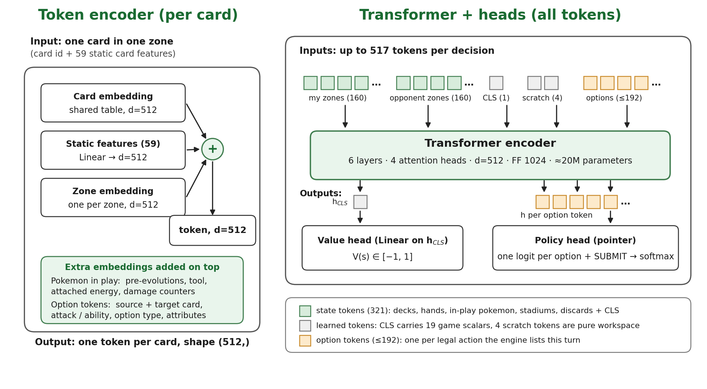
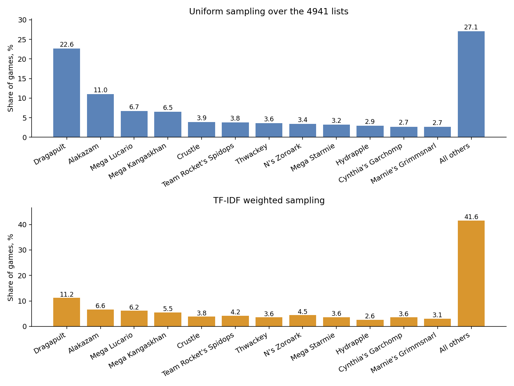
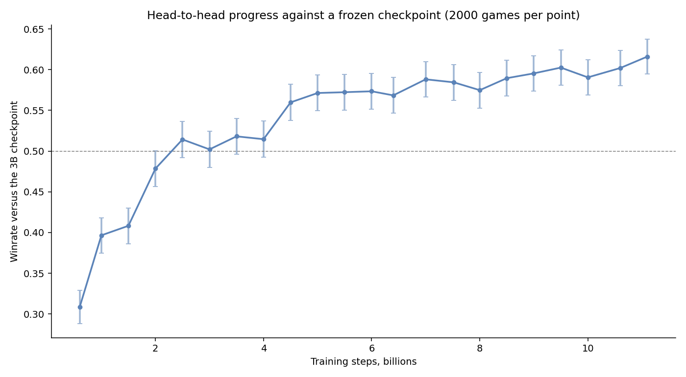
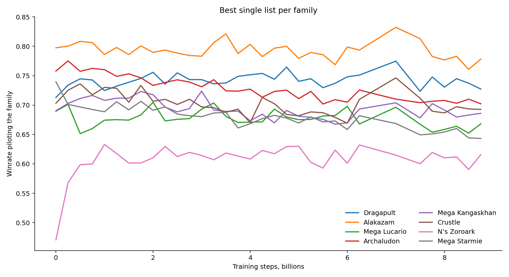
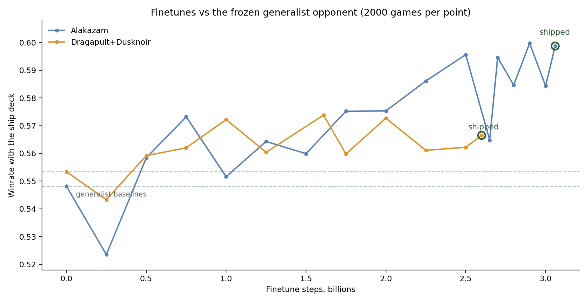
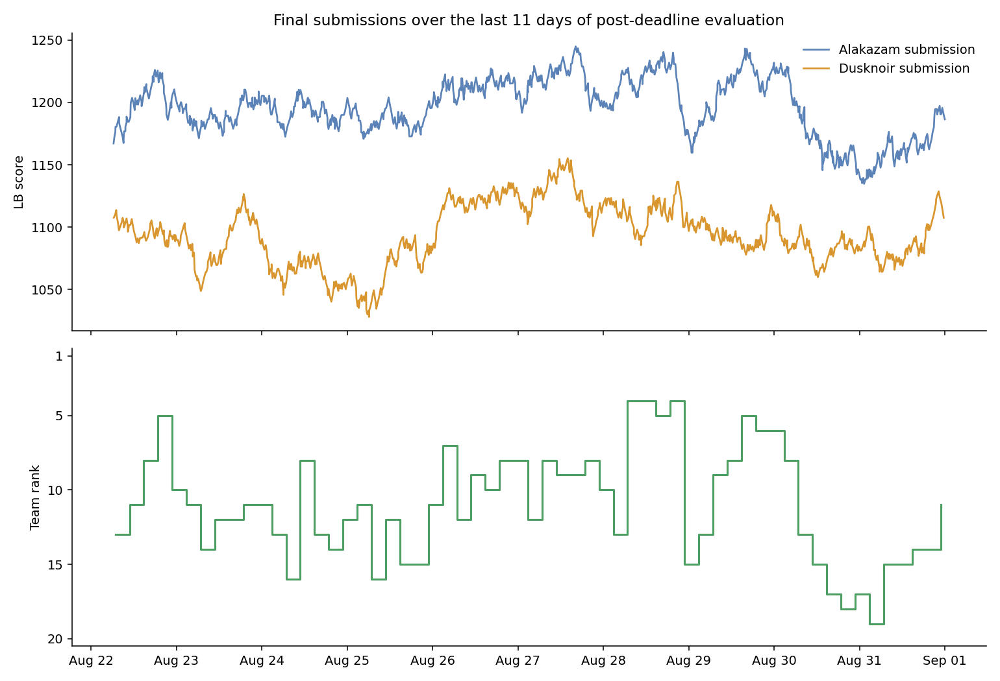

# Self-Play RL for the Pokémon TCG: 12th Place Solution

**Subtitle:** Trained a 20M parameter model for 11B steps to play almost 5000 different PTCG decks.

---

## Acknowledgements

Huge thanks to The Pokémon Company and the Kaggle team for organizing such a fun and engaging competition. This was my first agent competition and I am happy it had such a cool theme.

## Short Summary

I trained a 20M parameter model for 11B steps to play almost 5000 different PTCG decks. Later I finetuned it on each of the 2 final submission decks for an additional 3B steps using a custom two-net finetune approach.

## Introduction

From the beginning I felt that PTCG is far too complex for hand-written heuristics. Hence I decided to pour all my efforts into an RL solution. The following observation shaped my entire approach:

> Although my agent plays only one deck on the Kaggle LB, I need to have a strong local agent that plays all decks at a decent level. This, in my opinion, is the only way for my Kaggle agent to have good local practice against diverse decks it can face on the Kaggle LB.

That's why I first trained a generalist model that can play almost 5000 decks and only after that I finetuned that model to min-max selected decks.

## State and Action Representations, NN Architecture

As I was planning to use a Transformer neural network, the state and action representations boiled down to "tokenizing" the entire game as well as possible, while not losing out on any information. This proved excessively difficult as PTCG is a complex game with a lot of variables and edge cases.

### State Representation

I represent all game states as a sequence of tokens (cards) in different "zones":

1. My deck - 60 tokens
2. My hand - 30 tokens
3. My bench and active pokemon - 9 tokens (1 active + 8 bench)
4. My stadium - 1 token
5. My discard pile - 60 tokens
6. Opponent's known deck - 60 tokens, known cards + rest UNK tokens
7. Opponent's known hand - 30 tokens, revealed cards + rest UNK tokens
8. Opponent's bench and active pokemon - 9 tokens
9. Opponent's stadium - 1 token
10. Opponent's discard pile - 60 tokens
11. One game-state token - 19 scalars (turn, deck/prize/hand counts etc. for both sides)

Each token is the sum of a learned card embedding, a projection of 59 static card features, and a zone embedding. The 59 features cover every card category: card type and stage, energy type, weakness, HP, attack costs etc. Pokemon in play (active + bench) also add embeddings of their pre-evolutions, tools, attached energy cards and damage counters. I have added those static features in hope of faster learning and better generalization to unseen cards. I could have saved one token by merging both stadium zones into one, but decided one saved token is not worth the extra stadium ownership complexity.

### Action Representation

Similarly to the state representation, I encode each possible action, returned by the engine, as one token and append it to the state token sequence. Each option token is the sum of:

1. Source card embedding
2. Target card embedding (a learned `no target` embedding when there is none)
3. Embedding of the attack or ability it uses
4. Embedding of its option type
5. Projection of extra attributes: action counts, attack damage and cost, etc.

### Neural Net Architecture



Each action in a turn is determined by one forward pass through a 20M parameter transformer model. A single card-embedding table is shared by every stream, so whatever the net learns about a card in one zone transfers to all the others. A nice property of transformers is that without positional embeddings they are order invariant, which is something we want in our model, since the order of cards, for example in hand or on bench, doesn't matter. The location of each card is determined entirely by the "zone" embedding. The value head reads the CLS token. The policy head scores the option tokens plus a `SUBMIT` logit to end the turn.

## Self-Play with PPO

As this was my first real attempt at self-play with PPO, I relied heavily on the excellent Orbit Wars writeups, especially: [1st Place Solution: Scaling Reinforcement Learning](https://www.kaggle.com/competitions/orbit-wars/writeups/1st-place-solution-scaling-reinforcement-learnin). The base is plain self-play PPO with GAE. One net plays both sides of every game, so the policy and value head train on the winner's and the loser's perspective at once. I also implemented a teacher, a frozen older copy of the net. I regularly evaluated the model head-to-head against the teacher, both to track progress and to decide promotion. When the learner clearly wins, the teacher is replaced with the current weights. This kept long runs from drifting or collapsing. Rewards are just +1/-1 at the end of the game, with one addition to prevent stalling. If a single turn lasts for 200 moves, the game ends immediately with a loss for the stalling side. This was especially helpful for decks that included Mega Venusaur, whose ability allowed for infinite stalling.

### Environment Speedups

The biggest improvement came from optimising the engine-side observation encoding. The engine returns every game state as a big JSON, and parsing those in Python dominated collection time. My fix was to skip JSON entirely. I made the engine export observations as a raw binary buffer and moved the whole state encoding into C on top of it. Together with CUDA-graph collection and variable-length attention, self-play ran at about 16.5k steps per second on 4 H200s.

### Used Decks

I acquired decks from two sources. First, I periodically downloaded the episodes of top players and read each deck straight out of the replay. Second, I scraped competitive human decklists from Limitless, keeping every list that placed top 128 at a major and every grassroots list that made top 8 at least twice. The final pool totaled 4941 decks, 3517 from Kaggle and 1424 from Limitless.

### Training The Generalist

The generalist was trained with self-play PPO on the full deck pool. Opponent decks were drawn with the TF-IDF sampling described in the next section. The run went to about 11B environment steps. Whenever progress plateaued I lowered the learning rate and increased the batch size. I did not use any learning rate schedule. The most important parameters:

```
[env]
num_envs = 768
turn_move_limit = 200

[train]
total_timesteps = 11_000_000_000
batch_size = 196_608      ; doubled from 98_304 after the first plateau
num_minibatches = 4
update_epochs = 1
gamma = 0.997
gae_lambda = 0.95
clip_coef = 0.2
ent_coef = 0.002
learning_rate = 1e-4      ; lowered to 5e-5 at ~4B steps and 2.5e-5 at ~9B
teacher_kl_coef = 0.005
promote_winrate = 0.53
```

#### TF-IDF Sampling

For the initial runs I used uniform sampling over the deck pool. This has a nice property of putting more weight on the decks that people experiment on the most, which we can suspect are the strong ones. However, the rarer, more unique decks get undertrained, and that is not what we are looking for in a general model. My solution to this problem was TF-IDF sampling:

$$w_d = \frac{1}{\frac{1}{N}\sum_{d'=1}^{N}\cos(v_d, v_{d'})}$$

where $v_d$ is the tf-idf vector of deck $d$, treating each deck as a document and each card as a word. A deck surrounded by many near-copies gets a low weight, a one-of-a-kind build gets a high one. The weights are clipped and normalized into a sampling distribution.



The resulting distribution cut the Dragapult and Alakazam shares roughly in half in favour of the more unique decks. I suspect that there are multiple solutions to this problem. However this one was so simple and elegant that I couldn't resist using it.

### Evaluation

I evaluated my checkpoints head-to-head against a frozen 3B-step checkpoint from an earlier run, on a fixed list of 1553 strong decks. In general this evaluation was extremely noisy. I suspect because of the large variance of starting positions, card draws and the huge diversity of decks.



As a second way of evaluation I used the Kaggle LB. Even small gains on my private eval translated into good progress on the LB. I hit and held rank 1 for multiple days on many occasions. First with Alakazam, later with Mega Lopunny as a counter to the Grimmsnarl wave, and later with Mega Lucario as a counter to Mega Lopunny. Those results confirmed that my agent was improving and could play different decks relatively well.


Throughout training I also saved the result of every training game played. This gave me results from about 50M games and let me gauge the strong decks quite well.



For basically the entire training run the two outstanding archetypes were Alakazam and Dragapult. I decided that my two final decks would come from these two archetypes.

## Final Deck Selection

### Alakazam

```
Pokemon (20):    4 Abra, 4 Kadabra, 4 Alakazam, 3 Dunsparce, 3 Dudunsparce,
                 1 Fezandipiti ex, 1 Shaymin
Items (17):      4 Buddy-Buddy Poffin, 4 Enhanced Hammer, 4 Poke Pad,
                 3 Rare Candy, 1 Night Stretcher, 1 Sacred Ash
Supporters (12): 4 Dawn, 3 Hilda, 2 Boss's Orders, 2 Xerosic's Machinations,
                 1 Lana's Aid
Stadium (4):     4 Battle Cage
Energy (7):      4 Telepath Psychic Energy, 1 Enriching Energy, 2 Psychic Energy
```

I started from the strongest Alakazam list in my 5000 deck pool and ran small ablations, one or two card swaps at a time, each measured over tens of thousands of games against the matchups I expected to meet on the LB. The biggest win was going up to 4 Battle Cage to counter Dragapult and Grimmsnarl. In hindsight, I think I would replace Xerosic's Machinations, it only mattered in the mirror matchup. I feel like Genesect+tools would probably have been the stronger option, for the additional card draw with Lucky Helmet and the ACE SPEC block.

### Dragapult+Dusknoir

```
Pokemon (20):    4 Dreepy, 4 Drakloak, 3 Dragapult ex, 2 Duskull, 2 Dusclops,
                 2 Dusknoir, 1 Budew, 1 Fezandipiti ex, 1 Meowth ex
Items (17):      4 Buddy-Buddy Poffin, 4 Crushing Hammer, 4 Poke Pad,
                 2 Night Stretcher, 2 Ultra Ball, 1 Unfair Stamp
Supporters (13): 4 Lillie's Determination, 3 Boss's Orders, 2 Crispin, 2 Dawn,
                 2 Judge
Stadium (2):     2 Jamming Tower
Energy (8):      4 Psychic Energy, 4 Fire Energy
```

My second pick was more experimental. I focused on bench sniping, Dragapult spreads damage counters over the opponent's bench and the Dusknoir line turns them into knockouts. On top of that, this archetype was absent from the LB, even in the final days. 

## Two-net Finetuning

The generalist diffused its 20M parameters and 50M games over almost 5000 decks. On average this gives only about 20000 games with any single deck, far too little to fight for the top LB spots.

For finetuning my key observation was:

> The Alakazam agent only needs to know how to play versus other decks, it doesn't need to know how to play them. The same can be said about the agent that plays against Alakazam, it needs to know how to play all the decks, but only versus Alakazam. This was the main idea behind my two-net finetune. 

So instead of finetuning one net against a frozen opponent, I trained two copies of the generalist at once. Net A always pilots the ship deck. Net B pilots the opponents, sampled from the meta and the known counter decks. This was quite hard to balance out, in most experiments one side started to dominate and collapsed the training. The design that worked for me was as follows:

Train the nets in turns, starting with Net A until it improves its WR by 2pp over baseline, then freeze net A and start to train net B to recover the lost points, repeat. This process repeated 6 times for Alakazam over 3.06B finetune steps and at least 8 times for Dragapult+Dusknoir over 2.67B finetune steps. Over the course of the finetunes I reduced the learning rate and the entropy coefficient. 



The submission agents are Net A checkpoints from both finetunes.

## Final Results

For the entire post-deadline window my Alakazam performed better than Dragapult+Dusknoir, most of the time hovering a bit above 1200 points at rank 5-13. Unfortunately, in the final 2 days it fell a lot and didn't get enough time to recover. I feel like 12th place undersells its true strength a little bit. Ultimately, my Alakazam agent was still the highest rated Alakazam agent in the competition.



## Improvements and Lessons Learned

1. The Alakazam deck selection. I feel like I lost a few precious placements because of Xerosic's Machinations instead of Genesect+tools.
2. My evaluation was too broad. 1553 decks diluted the signal too much. Fewer, stronger decks would have been a better discriminator.
3. A fixed learning rate worked better. My initial 3B run failed here, the schedule annealed too early and the run crawled.
4. Too many tokens per state. The sequence is over 300 tokens and a lot of them are deck cards, discard cards or UNK tokens. Some convolution or pooling over those zones could cut the compute a lot.
5. I scaled the model size too early instead of optimising hyperparameters.
